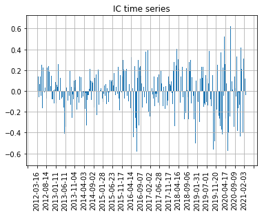
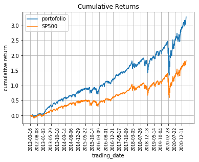

[](http://quantlet.de/)

## [](http://quantlet.de/) **StockCorr_Asset_Allocation** [](http://quantlet.de/)

```yaml

Name of Quantlet: 'StockCorr_Asset_Allocation'

Published in: 'SDA_2021_NUS/SDA_2021_NUS_Stock_Return_Correlation_Clustering'

Description: 'Use HRP method to get allocation weights for portfolio and create back test based on allocation'

Keywords: 'stock, correlation, HRP, hierarchical risk parity, asset allocation, back test'

Author: 'Li Yilin, Mei Yuxin, Sun Qingwei, Xie Chuda, Zhang Yingxin'

See also: 'StockCorr_Data_Downloader, StockCorr_Clustering_Analysis'

Submitted:  '01. Apr 2021'

Datafile: 'NASDAQ and NYSE stock mega/large/mid/small cap stock daily prices'

```





### PYTHON Code
```python

# -*- coding: utf-8 -*-
"""
Created on Sat Mar 27 13:45:33 2021

@author: 24978
"""
import pandas as pd
import numpy as np
import matplotlib.pyplot as plt
import matplotlib.ticker as ticker
from scipy import stats
import process as p
import os

def get_cum_ret(data):
    temp = data.apply(lambda x:np.log(x+1))
    temp = temp.cumsum()
    temp = temp.apply(lambda x:np.exp(x)-1)
    return temp

def get_max_drawdown(vec):
    high = vec[0]
    maxdrawdown = 0
    for i in vec:
        if i>high:
            high = i
        else:
            maxdrawdown = max(maxdrawdown,high-i)
    return maxdrawdown

def plot_ret(data,benchmark):
    ax = plt.subplot()
    ax.plot(data.index,data['cum_ret'],label='portofolio')
    ax.plot(benchmark.index,benchmark['cum_ret'],label='SP500')
    tick_spacing = 100    
    ax.xaxis.set_major_locator(ticker.MultipleLocator(tick_spacing))
    plt.legend()
    plt.title('Cumulative Returns')
    plt.xlabel('trading_date')
    plt.ylabel('cumulative return')
    plt.xticks(size='small',rotation=90,fontsize=8)
    plt.grid()
    plt.show()

def plot_IC(data):
    ax = plt.subplot()
    ax.bar(data.index,data['ic'])
    tick_spacing = 100     
    ax.xaxis.set_major_locator(ticker.MultipleLocator(tick_spacing))
    plt.title('IC time series')
    plt.xticks(size='small',rotation=90,fontsize=10)
    plt.grid()
    plt.show()
    

if __name__ == '__main__':
    # get data
    factor = pd.read_pickle('weight1.pk')
    factor = factor.T
    factor.dropna(how='all',axis=0,inplace=True)
    factor['info_date'] = factor.index
    factor['trading_date'] = factor['info_date'].shift(-1)
    factor.drop(factor.tail(1).index,inplace=True)
    factor.set_index('trading_date',inplace=True)
    factor.drop('info_date',axis=1,inplace=True)
    symbols = p.get_symbols_from_file(os.path.join('sectors', 'sp500_symbol.csv'))
    data = p.get_data(symbols)
    data.set_index('Date', inplace=True)
    data.sort_index(inplace=True)
    ret = data.pct_change()
    ret.drop(ret.head(1).index,inplace=True)
    ret = ret.loc[factor.index[0]:]
    sp500 = pd.read_excel('SP500.xlsx')
    sp500['date'] = sp500['date'].astype('str')
    sp500.set_index('date',inplace=True)
    ret_sp500 = pd.DataFrame(sp500.pct_change().values,columns=['ret'],index=sp500.index)
    ret_sp500 = ret_sp500.loc[ret.index[0]:ret.index[-1]]
    # ic
    ic = pd.DataFrame(np.nan,index=factor.index,columns=['ic'])
    for i in ic.index:
        x1 = factor.loc[i].replace({np.nan:0}).astype('float')
        x2 = ret.loc[i].replace({np.nan:0}).astype('float')
        ic['ic'][i] = stats.spearmanr(x1,x2)[0]
    plot_IC(ic)
    # cumret
    weight_ret = factor * ret
    portfolio_ret = pd.DataFrame(weight_ret.sum(axis=1),columns=['daily_ret'])
    portfolio_ret['cum_ret'] = get_cum_ret(portfolio_ret['daily_ret'])
    ret_sp500['cum_ret'] = get_cum_ret(ret_sp500['ret'])
    # performance
    ic_mean = ic.mean()[0]
    ir = ic_mean / ic.std()[0]
    daily_ret = np.nanmean(portfolio_ret['daily_ret'].values.astype('float'))
    anl_ret = (1+daily_ret) ** 252 - 1
    anl_vol = portfolio_ret['daily_ret'].values.astype('float').std() * np.sqrt(252)        
    sharpe_ratio = anl_ret / anl_vol    
    maxdrawdown = get_max_drawdown(portfolio_ret['cum_ret'])    
    table = pd.DataFrame([[ic_mean],[ir],[anl_ret],[sharpe_ratio],[maxdrawdown]],index=['IC','IR','annual_return','sharpe','maxdrawdown'],columns=['performance'])
    plot_ret(portfolio_ret,ret_sp500)
    print(table)
    
    
    
    
    
    
    


```

automatically created on 2021-04-01